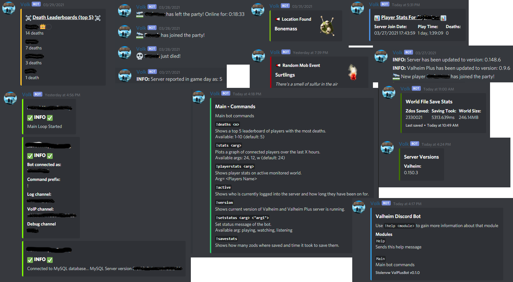

# Valheim-Discord_Bot
Valheim discord bot originally based off of [ckbaudio's valheim-discord-bot](https://github.com/ckbaudio/valheim-discord-bot).

## UPDATE RELEASED 12/10/2022:
### UPDATE INFO:
### [v2.dbupdate.py](dbupdates/v2.dbupdate.py)
Move to the code dir and run `python3 v2.dbupdate.py` to update database's.  

### Changes:
*discord.py updated to version 2.1.0*  
*Bot now uses slash commands, instead of !prefix*  
*Updated for crossplay and Mistlands*  
*Bot logging to logfile, USEDEBUGCHAN setting outputs stuff from the logfile to BUGCHANNEL_ID*  
*New config file options*  
*Other dependencies also updated to newest versions*  
*"stats" and "help" commands removed*

## Setup:
**Working MySQL server is needed for this bot.**  
`pip install -r requirements.txt` To install Pyhton requirements.

## [config.py](code/config.py)
Edit this file with your info. Setting should be self-explanitory.  

Add `-logfile /location/to/file.log` to your start command to get a logfile.  

For `WORLDSIZE` user running the bot must have read permissions to the world.db.old file

## [dbsetup.py](code/dbsetup.py)
Tables and data for the MySQL database.  

**Warning: Set up the config.py before running this**  
Run `python3 dbsetup.py` from the code dir to create tables.

## [eventsdbupdate.py](dbupdates/eventsdbupdate.py)
Move to the code dir and run `python3 eventsdbupdate.py` to update the events database with new events.

## [mistlandsbossdb.py](dbupdates/mistlandsbossdb.py) 12/15/2022
Move to the code dir and run `python3 mistlandsbossdb.py` to update the events database with location found announcement info for mistlands boss.

## Usage:
`python3 valheimbot.py` While in the `code` dir.  
`nohup python3 valheimbot.py &` Too run in background.  
Or you can create a service to run `valheimbot.py` under systemd  

**help** Shows available commands

### Example Output:

